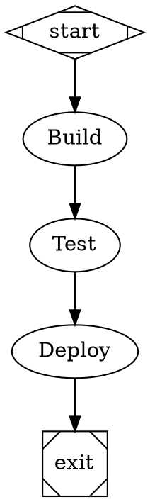

# attractor-c

A pure C11 implementation of the [Attractor](https://github.com/strongdm/attractor) specification from [StrongDM](https://strongdm.com) — a pipeline engine for orchestrating coding agents through directed graph workflows.

Attractor defines pipelines as DOT digraphs where nodes are stages (LLM prompts, tool invocations, human gates) and edges encode control flow with conditional branching, retries, and parallel execution. This implementation covers the full spec surface: the pipeline engine, a unified LLM client, and the coding agent loop.

## What it does

You write a pipeline as a `.dot` file:



Then run it:

```
./attractor pipeline.dot
```

The engine walks the graph, dispatching each stage to an LLM-backed coding agent that can read/write files, search code, and execute shell commands — then routes to the next stage based on outcomes, conditions, and edge labels.

## Building

Requires a C11 compiler, libcurl, and pthreads (standard on macOS and Linux).

```
make
```

This produces:
- `libattractor.a` — static library
- `attractor` — CLI binary

## Usage

```
attractor [OPTIONS] <pipeline.dot>

Options:
  --logs-dir <dir>      Log/artifact directory (default: ./attractor-run-<timestamp>)
  --validate-only       Parse and validate the pipeline without executing
  --dry-run             Execute with a simulated LLM backend
  --auto-approve        Auto-approve all human gates
  --resume <checkpoint> Resume from a checkpoint file
  --model <model>       Override default LLM model
  --provider <name>     Override default LLM provider (anthropic, openai, gemini)
  --verbose             Verbose event output
```

Set one or more API keys to enable LLM providers:

```
export ANTHROPIC_API_KEY=sk-...
export OPENAI_API_KEY=sk-...
export GEMINI_API_KEY=...
```

## Architecture

```
src/
  main.c                CLI entry point
  attractor/
    dot_parser.c        DOT digraph parser with attractor extensions
    validator.c         Graph validation and diagnostics
    engine.c            Pipeline runner, handlers, checkpointing
  llm/
    client.c            Unified multi-provider LLM client
    types.c             Message/tool types and serialization
    adapters.c          Provider-specific API adapters
  agent/
    agent.c             Coding agent loop with tool dispatch
  util/
    json.c              Lightweight JSON parser/builder
    http.c              HTTP client (libcurl wrapper)
    str.c               String utilities

include/
    attractor/          Engine, parser, validator headers
    llm/                LLM client and type headers
    agent/              Agent session headers
    util/               JSON, HTTP, string utility headers
```

### Key concepts

- **DOT pipelines** — Standard Graphviz digraph syntax extended with `prompt`, `goal_gate`, `tool_command`, `class`, `model_stylesheet`, and other attributes defined by the [Attractor spec](https://github.com/strongdm/attractor).
- **Stage handlers** — Pluggable executors for each node type: `codergen` (LLM agent), `tool` (shell command), `wait.human` (interactive gate), `parallel`, `fan-in`, `conditional`, `manager_loop`.
- **Conditional edges** — Edges with `condition` attributes evaluated against stage outcomes and pipeline context (`outcome=success`, `preferred_label=Fix`, arbitrary context key checks).
- **Model stylesheets** — CSS-like syntax for assigning LLM models, providers, and reasoning effort to stages by wildcard, class, or ID selector.
- **Context fidelity** — Controls how much pipeline context is included in LLM prompts (`full`, `truncate`, `compact`, `summary:low/medium/high`).
- **Checkpointing** — Automatic checkpoint saves at each stage for `--resume` after interruption.
- **Unified LLM client** — Single interface across Anthropic, OpenAI, and Google Gemini with automatic retries, tool-use loops, and streaming support.

## Spec compliance

This implementation targets the three NLSpecs published in the [strongdm/attractor](https://github.com/strongdm/attractor) repository:

| Spec | Covers |
|------|--------|
| [attractor-spec.md](https://github.com/strongdm/attractor) | Pipeline engine, DOT extensions, validation, execution model |
| [coding-agent-loop-spec.md](https://github.com/strongdm/attractor) | Agent session lifecycle, tool dispatch, conversation management |
| [unified-llm-spec.md](https://github.com/strongdm/attractor) | Multi-provider LLM client, retries, tool-use protocol |

The `test/` directory contains sample pipelines exercising branching, conditions, parallel execution, and model stylesheets.

## Example pipelines

See `test/` for working examples:

- `simple.dot` — Linear two-stage pipeline
- `branching.dot` — Conditional branching based on stage outcomes
- `conditions.dot` — Context-driven edge conditions
- `parallel.dot` — Parallel stage execution with fan-in
- `styled.dot` — Model stylesheet demonstration

The `spec-dod.dot` and `spec-dod-multimodel.dot` pipelines in the project root are real-world examples that use Attractor to audit and fix its own spec compliance — a self-referential pipeline that validates the implementation against the specification.

## Development notes

Initial bootstrapping with a [Ralph loop](https://github.com/anthropics/claude-code/tree/main/plugins/ralph-loop). Spec compliance finalized with attractor-c.

## License

Apache 2.0 — see [LICENSE](LICENSE).
